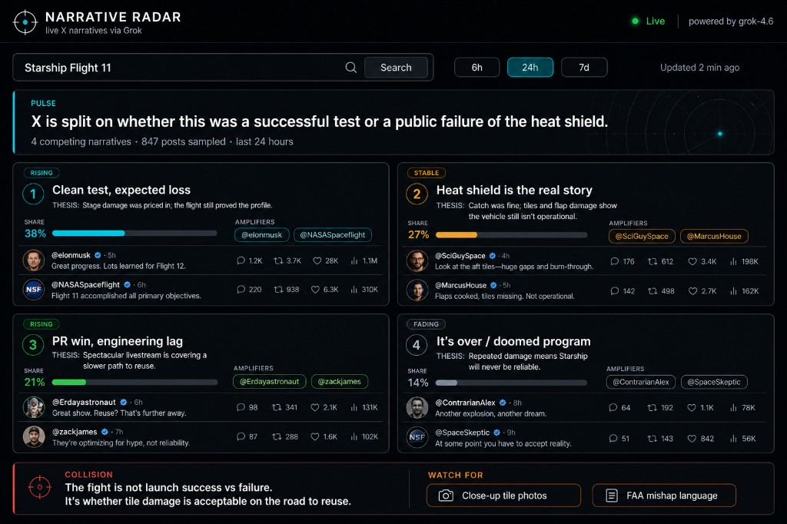

# Narrative Radar — team handoff

**Status:** idea + UI mockup only. No app code yet.  
**Constraint:** 4-hour hackathon using **Grok 4.6**.  
**Decision:** build **Narrative Radar**, not a generic Grok chatbot.

Share this file (and `assets/narrative-radar-ui-mockup.png`) with teammates. They can also `@HANDOFF.md` in a new Cursor chat and say: *scaffold Narrative Radar from this handoff*.

To share the original Cursor thread: open this chat → **Share** in the header → Team or Public link. Recipients can **Fork to Cursor** to continue with full history. (Teams/Enterprise; not available on all plans.)

---

## One-liner

Live briefing tool: type a topic, Grok searches X, UI shows the **competing stories people are telling** — who is pushing each one, and which is winning — with post receipts.

Not sentiment (positive/negative). Not a news summary. **Factions with citations.**

---

## Why Grok (the moat)

Grok has first-party **`x_search`**: keyword, semantic, user, and thread fetch on X. No X API, no scraping. Attach the tool; Grok searches and returns citations.

Grok 4.6 is also strong at knowledge-work clustering (name, compare, brief). Use it for **analysis**, not as a chat box with search glued on.

Docs: [X Search](https://docs.x.ai/developers/tools/x-search)

```js
tools: {
  x_search: xai.tools.xSearch({
    fromDate: '2026-08-14',
    toDate: '2026-08-15',
    // optional: allowedXHandles / excludedXHandles (max 20, not both)
  }),
}
```

Skip `enableImageUnderstanding` / `enableVideoUnderstanding` for MVP.

---

## Product

**Input**

- Topic (person, ticker, event, phrase)
- Window: last 6h / 24h / 7d → `from_date` / `to_date`

**Output (one screen)**

1. **Pulse** — one sentence: what X is actually arguing about
2. **3–5 narrative cards** — each is a thesis, not a sentiment bucket
   - label + one-line thesis
   - share of conversation (rough %)
   - trajectory: rising / stable / fading
   - amplifiers (`@handle` + why)
   - 2–3 cited posts
3. **Collision** — the disagreement that matters
4. **Watch for** — 2 bullets that would flip the story

No login, no DB, no history. One search → one report.

---

## UI mockup



Layout top → bottom:

| Region | What it is |
| --- | --- |
| Top bar | Wordmark + live indicator |
| Query | Topic field + `6h / 24h / 7d` pills |
| Pulse | Full-width one-sentence brief |
| Cards | 2×2 narrative grid with share bars, amplifiers, tweet receipts |
| Bottom | Collision (left) + Watch for (right) |

**Build the UI against hardcoded JSON first**, then swap in Grok. If the API is slow, the demo still looks finished.

Cards that **contradict each other** are the punchline. If cards are Positive / Negative / Neutral, the product failed.

---

## Data contract

Force JSON. Do not stream a blog post.

```ts
type RadarReport = {
  topic: string
  window: string
  pulse: string
  narratives: {
    id: string
    label: string
    thesis: string
    sharePct: number // 0–100, rough
    trajectory: "rising" | "stable" | "fading"
    amplifiers: { handle: string; why: string }[]
    receipts: { url: string; quote: string }[]
  }[]
  collision: string
  watchFor: string[]
}
```

---

## Model prompt (use this)

> Search X for this topic in the given window. Identify 3–5 distinct narratives (not sentiment buckets). For each: name it, state the thesis, estimate share of the conversation you saw, list amplifiers, and attach 2–3 post URLs. Then name the core collision. Do not merge opposing stories into one “mixed sentiment” paragraph. If evidence is thin, say so — do not invent factions.

Quiet topics should return one narrative or an honest “not enough disagreement to cluster.”

---

## Stack (fits 4 hours)

```
Next.js (App Router)
  └── /api/radar   POST { topic, window }
        └── generateObject() + grok-4.6 + x_search
  └── /            search + pulse + cards + collision
```

- **Vercel AI SDK:** `xai.responses('grok-4.6')` + `xai.tools.xSearch()` + `generateObject` + Zod schema
- **Env:** `XAI_API_KEY` in `.env.local` (never commit)
- **Tweets:** official embed if time; otherwise handle + quote + link
- **No auth, no database**
- One request per submit; debounce; disable double-click

---

## 4-hour plan

| Time | Work |
| --- | --- |
| 0:00–0:30 | Next.js app, env, **hardcoded JSON**, full UI |
| 0:30–1:30 | Wire `generateObject` + `x_search`; citations on cards |
| 1:30–2:30 | Polish: share bars, chips, collision, loading/empty/error |
| 2:30–3:15 | Live trending topics; tune prompt so it **splits** narratives |
| 3:15–4:00 | **One** stretch + 60s demo script |

**Stretch (pick one, not all)**

- Compare windows: last 6h vs previous 6h
- Handle filter: `allowed_x_handles`
- Click two cards → steelman each in 4 bullets
- Meme layer: `enableImageUnderstanding: true`

**Out of scope:** generic chatbot, auth, persistence, CAD, full agent platform.

---

## Demo script (~60s)

1. Type whatever is **actually trending that hour**. Not a canned example.
2. Cards appear. Point at two that contradict.
3. Click receipts. Real posts, not paraphrases.
4. Say: *This is not sentiment. Sentiment would say “mixed.” Radar tells you which story is winning.*
5. Optional: compare-windows — *Six hours ago it was X. Now it’s Y.*

**Positioning:** *Narrative Radar uses Grok’s live X search to map competing stories on a topic in minutes — who is telling which version, and which one is winning.*

---

## Risks

| Risk | Mitigation |
| --- | --- |
| Quiet topic → fake clusters | Honest empty state |
| Grok runs several searches → latency | “Searching X…” status, never a frozen page |
| Cost / rate limits | One search per submit, debounce |
| Missing citation URLs | Fall back to quote + handle |
| Looks like a sentiment dashboard | Thesis names, not pos/neg/neu |

---

## What exists vs what does not

**Done in this chat**

- Chose Narrative Radar over other 4-hour Grok ideas
- Product spec, JSON schema, prompt, stack, hour plan, demo script
- UI mockup: `assets/narrative-radar-ui-mockup.png`

**Not started**

- Next.js app, API route, live `x_search`, deploy

---

## Continue in Cursor

Paste this into a new agent chat with `@HANDOFF.md` and the mockup attached:

```text
Scaffold Narrative Radar from HANDOFF.md.

Build a Next.js App Router app with:
1. A single page matching assets/narrative-radar-ui-mockup.png (dark intelligence dashboard).
2. Hardcoded sample RadarReport JSON so the UI is complete before the API works.
3. POST /api/radar using Vercel AI SDK: grok-4.6 + xai.tools.xSearch() + generateObject + Zod.
4. Wire the form (topic + 6h/24h/7d) to the API. Loading, empty, and error states.
5. .env.example with XAI_API_KEY. No auth, no DB.

Do not invent Positive/Negative/Neutral cards. Narratives are theses.
```
