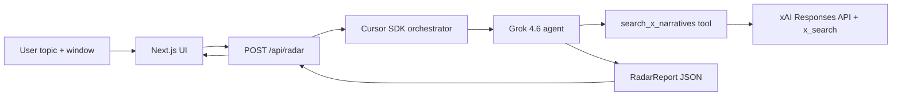

# architecture_handoff

## Current Branch

Branch: `architecture/cursor-sdk-orchestration`

Purpose: set up the repo architecture for Narrative Radar with a Next.js app,
TypeScript shared contracts, and Cursor Agent SDK orchestration using Grok 4.6.

No Python backend is planned for the MVP. The Cursor SDK already has a
TypeScript package (`@cursor/sdk`), and keeping the app/API/orchestration in
one TypeScript runtime is the fastest path for the 4-hour hackathon.

## Product Context

Narrative Radar is not a generic chatbot and not sentiment analysis.

User enters a topic and time window. The system returns competing narratives:

- one pulse sentence
- 1-5 narrative cards
- amplifiers and receipts
- the core collision
- watch-for signals that could flip the story

Quiet topics should return one honest narrative or evidence-thin output. Do not
invent Positive / Negative / Neutral buckets.

## Architecture



The important boundary: the API route is thin. All model/tool orchestration
lives in `src/server/radar`.

## Runtime Decision

We are using:

- Next.js App Router
- TypeScript
- `@cursor/sdk`
- Grok 4.6 as the agent model
- Zod for shared schema validation
- xAI `x_search` behind a narrow tool used by the Cursor SDK agent

We are not using Vercel AI as the main orchestration layer. It was useful in the
original handoff because it has a short `generateObject + x_search` path, but
our hackathon story is stronger if Cursor Agent SDK owns the orchestration.

## Repo Ownership

Frontend teammate should own:

- `src/app/page.tsx`
- `src/components/radar/*`
- `src/app/globals.css`

Backend/orchestration should own:

- `src/app/api/radar/route.ts`
- `src/lib/radar/*`
- `src/server/radar/*`
- `.env.example`
- `next.config.ts` only for server bundling/runtime concerns

Shared contract:

- Frontend imports `RadarReport`, `RadarResponse`, and `sampleRadarReport` from
  `src/lib/radar`.
- Backend validates generated reports with the same Zod schema.

## Important Files

- `src/lib/radar/schema.ts`
  Shared request, response, narrative, and report schemas.

- `src/lib/radar/sample-report.ts`
  Mockup-style data so frontend can build without live agent calls.

- `src/lib/radar/time-window.ts`
  Converts `6h`, `24h`, and `7d` into date ranges for search.

- `src/server/radar/orchestrator.ts`
  Creates the local Cursor SDK agent with `model: { id: "grok-4.6" }`, provides
  only the custom tool surface, parses JSON, and validates the report.

- `src/server/radar/tools/x-search.ts`
  Calls xAI Responses API with the `x_search` tool and returns evidence to the
  Cursor agent.

- `src/server/radar/prompts.ts`
  The report-generation prompt. This is where we enforce "narratives are
  theses, not sentiment buckets."

- `src/app/api/radar/route.ts`
  Thin route handler: parse body, call orchestrator, return typed JSON.

- `next.config.ts`
  Uses `serverExternalPackages: ["@cursor/sdk"]` so Next/Turbopack does not try
  to bundle the Cursor SDK internals.

## Environment

Copy `.env.example` to `.env.local`:

```txt
CURSOR_API_KEY=
XAI_API_KEY=
RADAR_USE_SAMPLE=false
```

Use `RADAR_USE_SAMPLE=true` while frontend is being developed or when demoing
without live model/API keys.

Node must be `>=22.13` because `@cursor/sdk` requires it. The local machine used
for setup was Node `21.4.0`, so install/build can warn even though static
validation currently passes.

## API Contract

Request:

```ts
type RadarRequest = {
  topic: string;
  window: "6h" | "24h" | "7d";
  useSample?: boolean;
};
```

Response:

```ts
type RadarResponse =
  | { ok: true; report: RadarReport }
  | {
      ok: false;
      error: {
        code: "bad_request" | "config_error" | "agent_error" | "provider_error";
        message: string;
      };
    };
```

## Validation So Far

These passed after the architecture work:

```txt
npx tsc --noEmit
npm run lint
npm run build
```

Known notes:

- `npm install` reports engine warnings unless Node is upgraded to `>=22.13`.
- `npm install` reported 3 audit findings from dependencies. They were not
  addressed yet because dependency triage was outside the architecture task.
- No commit has been made yet.

## Suggested Parallel Work

Frontend branch:

1. Build the dashboard against `sampleRadarReport`.
2. Keep components under `src/components/radar/*`.
3. Call `POST /api/radar` only after the static UI is polished.

Backend branch:

1. Smoke-test `POST /api/radar` with `RADAR_USE_SAMPLE=true`.
2. Upgrade local/deploy Node to `>=22.13`.
3. Test live path with real `CURSOR_API_KEY` and `XAI_API_KEY`.
4. Tune `src/server/radar/prompts.ts` if Grok emits sentiment buckets or weak
   citations.

## Push Recommendation

Push this branch once the team is ready to share the architecture baseline:

```bash
git push -u origin architecture/cursor-sdk-orchestration
```

Do not push directly to `main`. Open a PR so the frontend branch can rebase or
merge only the shared contract/API pieces it needs.
