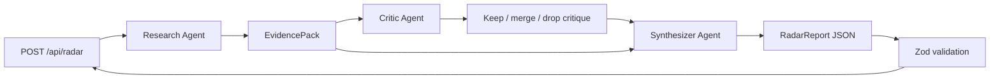

# Backend Orchestration Design

Branch: `backend/radar-orchestration-v1`

This branch is for designing and implementing the backend orchestration layer
for Narrative Radar. The goal is to keep the product agentic without making the
4-hour hackathon build fragile.

## Decision

Use an optimized staged pipeline: **Option B-lite**.

Full Option B would be:

```txt
planner -> N researchers -> critic -> synthesizer
```

That is too much runtime and coordination for the MVP. Instead:

```txt
research_agent -> critic_agent -> synthesizer_agent
```

This keeps the multi-agent architecture visible and useful, but avoids spawning
one researcher per narrative.

## High-Level Flow



## Agent Responsibilities

### 1. Research Agent

Job: gather live X evidence and propose candidate narratives.

This is the only stage that should use external search.

Inputs:

- `topic`
- `window`
- date range from `src/lib/radar/time-window.ts`

Tools:

- `search_x_narratives`

Output shape:

```ts
type EvidencePack = {
  topic: string;
  window: "6h" | "24h" | "7d";
  searchedRange: { fromDate: string; toDate: string };
  candidateNarratives: {
    id: string;
    label: string;
    thesis: string;
    evidence: {
      handle?: string;
      quote: string;
      url?: string;
    }[];
    roughSharePct?: number;
  }[];
  notableAmplifiers: {
    handle: string;
    why: string;
  }[];
  evidenceThin: boolean;
};
```

Rules:

- Search X before proposing narratives.
- Prefer thesis-level labels, not sentiment labels.
- If the topic is quiet, return one candidate and set `evidenceThin: true`.
- Do not invent factions to fill the UI.

### 2. Critic Agent

Job: attack the candidate narratives before we show them.

This agent should not use search. It judges the research output.

Tools:

- none for MVP

Output shape:

```ts
type NarrativeCritique = {
  decisions: {
    narrativeId: string;
    action: "keep" | "merge" | "drop";
    reason: string;
    mergeInto?: string;
  }[];
  collisionCandidate: string;
  warnings: string[];
};
```

Rules:

- Drop Positive / Negative / Neutral buckets.
- Merge narratives that share the same thesis with different wording.
- Flag weak receipts, missing URLs, or fake balance.
- Allow `N = 1` when disagreement is thin.

### 3. Synthesizer Agent

Job: emit the final product contract.

This stage converts the research and critique into `RadarReport`.

Tools:

- `validate_radar_report`
- `normalize_share_percentages`

Output:

- `RadarReport` from `src/lib/radar/schema.ts`

Rules:

- Return JSON only.
- `narratives.length` must be 1-5.
- Every narrative must have a thesis.
- Receipts should be actual post URLs when available.
- `collision` should name the disagreement underneath the narratives.
- `watchFor` should be concrete signals that could flip the story.

## Tool Set

### `search_x_narratives`

Used by: Research Agent

Purpose: call xAI Responses API with Grok 4.6 and `x_search`.

This tool returns evidence, not the final report.

### `validate_radar_report`

Used by: Synthesizer Agent

Purpose: run the final JSON through the Zod `radarReportSchema` and return
schema errors in a model-readable format.

### `normalize_share_percentages`

Used by: Synthesizer Agent

Purpose: normalize rough narrative shares so they are bounded and approximately
sum to 100.

This should be deterministic code, not another model call.

## Cursor SDK Boundary

All agents use Cursor SDK with Grok 4.6:

```ts
Agent.create({
  model: { id: "grok-4.6" },
  tools: ["mcp"],
  local: {
    cwd: process.cwd(),
    customTools,
  },
});
```

Do not give these request-time agents shell/edit/write tools. They are
product-analysis agents, not coding agents.

## API Boundary

`src/app/api/radar/route.ts` should remain thin:

```txt
parse request -> call generateRadarReport -> return RadarResponse
```

No prompt text, model selection, retries, or tool code should live in the route.

## MVP Implementation Order

1. Add `EvidencePack` and `NarrativeCritique` schemas under `src/lib/radar`.
2. Split `generateRadarReport` into three orchestration stages.
3. Add `validate_radar_report` custom tool.
4. Add `normalize_share_percentages` custom tool.
5. Keep `RADAR_USE_SAMPLE=true` path working for frontend.
6. Smoke-test with `useSample: true`, then live keys.

## What We Are Not Building Yet

- One researcher per narrative.
- User accounts.
- Persistence.
- Background jobs.
- Python service.
- Generic chat UI.
- Full eval harness.

Those are future product/backend work, not the hackathon path.

## Risks

### Latency

Three Cursor agent runs can be slower than one. Keep prompts short and avoid
extra search calls.

### Invalid JSON

The synthesizer must validate and repair once if the schema fails. Do not retry
the full search unless the search tool itself failed.

### Weak Citations

If `x_search` returns weak or missing URLs, keep the receipt quote/handle and
flag evidence as thin rather than inventing receipts.

### Over-Agenting

This pipeline is already the maximum complexity for a 4-hour demo. Any extra
agent should replace a stage, not add another required step.
